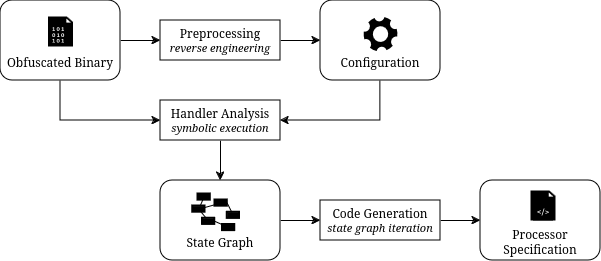

# ghidra-tigress-deobf

Proof of concept for (currently semi-)automated deobfuscation of
[Tigress](https://tigress.wtf/) virtual machines using the
[SLEIGH](https://trattue.de/ghidra/languages/html/sleigh.html) processor
specification language with [Ghidra](https://ghidra-sre.org/).

Virtual machine obfuscation reduces the possibility of reusing knowledge between
samples due to added randomization. Therefore, automated analysis and
deobfuscation are criteria of an ideal deobfuscation process. We aim to achieve
this by treating the VM as unknown processor architecture and generating
processor specifications for Ghidra. This way, we are able to apply Ghidra's
decompilation capabilities on the VM bytecode.

The general workflow looks like this:

0. **Virtual Machine Model:**\
   Analyze the virtual machine to gain reusable information about the general
   virtual machine structure and behavior. We have already manually reverse
   engineered the [Tigress VM](https://tigress.wtf/virtualize.html) and this
   tool focuses on Tigress VMs only, so this step is only needed if adapting the
   approach for other virtual machines.
1. **Preprocessing of Samples:**\
   Discover internal VM structure, for example addresses of VM variables (VPC,
   VSP, ...), VM handler bounds, instruction formats. Currently, this is mostly
   done manually by supplying a [TOML](https://toml.io/) configuration file.\
   *Implementation in the [`gtd.config`](./src/gtd/config) module*
2. **VM Handler Analysis:**\
   Use symbolic execution via [angr](https://angr.io/) to automatically extract
   symbolic representations ([claripy](https://github.com/angr/claripy) ASTs) of
   the individual VM handlers.\
   *Implementation in the [`gtd.backend`](./src/gtd/backend) module*
3. **Code Generation:**\
   Automatically generate a SLEIGH processor specification for use with Ghidra
   by transpiling the claripy ASTs to P-Code and generating a Ghidra plugin.\
   *Implementation in the [`gtd.frontend`](./src/gtd/frontend) module*



## Usage
### Prerequisites

We use [poetry](https://python-poetry.org/) as build and dependency management
tool, so please make sure to install it
([installation guide](https://python-poetry.org/docs/)).

Then, clone the project and fetch the dependencies of this project:

```sh
git clone https://github.com/Trattue/ghidra-tigress-deobf.git
cd ghidra-tigress-deobf
poetry config --local installer.no-binary capstone
poetry install
```

### Running the Tool

Assuming you have a working configuration and the VM bytecode in a file
specified in the configuration, use poetry to run the tool:

```sh
poetry run main <path_to_config>
```

You will find the plugin(s) in the `plugins/` directory. Feel free to play
around with the samples in the `samples/` folder to become more familiar with
the functionality.

#### Preparing Sample

Before creating a configuration, we need to create a sample binary containing a
Tigress VM. In the `samples/` folder, you will find a binary file called
`samplea.out`, which is a sample created using the `samplea.c` source file and
the `samplea.sh` obfuscation script.

Additionally, to later be able to decompile the bytecode in Ghidra, we need to
extract the VM bytecode into a file. Find the bytecode in Ghidra and use a hex
editor of your choice to save those bytes to a new file. In the `samples/`
folder, you will find binary files called `samplea.out.fib` or
`samplea.out.xtea`; those are bytecodes extracted from the `samplea.out`
executable.

#### Creating a Configuration

Every configuration file starts by specifying the binary executable to analyze:

```toml
# Path relative to the project root directory
binary_path = "samples/sample1.out"
```

Then, we specify the different virtual machines in the `virtual_machine` array.
Here, we specify a VM called `sample1-foobar`:

```toml
[[virtual_machines]]
name = "sample1-foobar"
```

To be able to track the VM state during symbolic execution, we need to find the
VPC, VSP, local variables array and the VM parameters of the VM we just defined.
We specify them relative to RBP; since they're at a negative offset, we omit the
minus sign:

``` toml
# Offsets to RBP (during handler execution)
# We omit the minus sign, in this example vpc is at RBP-0x160 ;)
[virtual_machines.locations]
vpc_offset = 0x160
vsp_offset = 0x158
locals_offset = 0x50
internal_offsets = [0x164]
```

The tool symbolically executes each VM handler seperately. Therefore, it needs
to know the handler boundaries (start is the first instruction to be executed
and end is the first instruction not to be executed anymore). Additionally, we
specify which opcode this handler represents and whether the tool should attempt
to automatically detect operands by detecting read accesses relative to VPC. If
this behavior is turned off, you need to declare the operands manually by
providing an ordered list of their sizes (assuming there is no padding between
operands):

``` toml
# Array of handlers: 
[[virtual_machines.handlers]]
opcode = 0x1
# Handler start: first instruction in the handler
start = 0x4011ba
# Handler end: first instruction after the handler (e.g. jmp <interpreter_loop>)
end = 0x401211
detect_operands = true

[[virtual_machines.handlers]]
opcode = 0x2
start = 0x123123
end = 0x123456
detect_operands = false
# Since detect_operands is false, we need to provide a list of operand sizes
operands = [4, 8]

[...]
```

Lastly, we define an array of functions called by the VM. There, we specify for
each function its address and argument count. While technically optional, it
improves the quality of the decompilation results:

``` toml
[[virtual_machines.functions]]
address = 0x401030
argument_count = 3
```

Another example VM definition, this time without funtion calls:

``` toml

[[virtual_machines]]
name = "sample1-xtea"
# No functions, so we can define an empty array here
functions = []

# VM handler definitions here
[...]
```

## Development
### Code Style

We use [black](https://github.com/psf/black) as python code formatter (with the
default line length of 88); docstrings should have a line length of 72. Normal
comments should have the same line length as other code).
